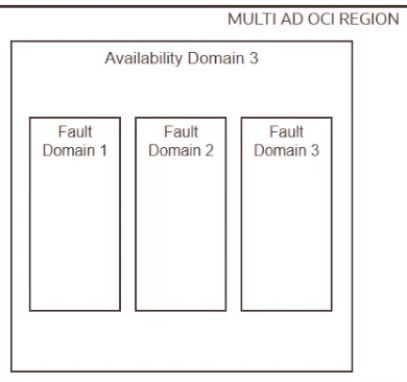
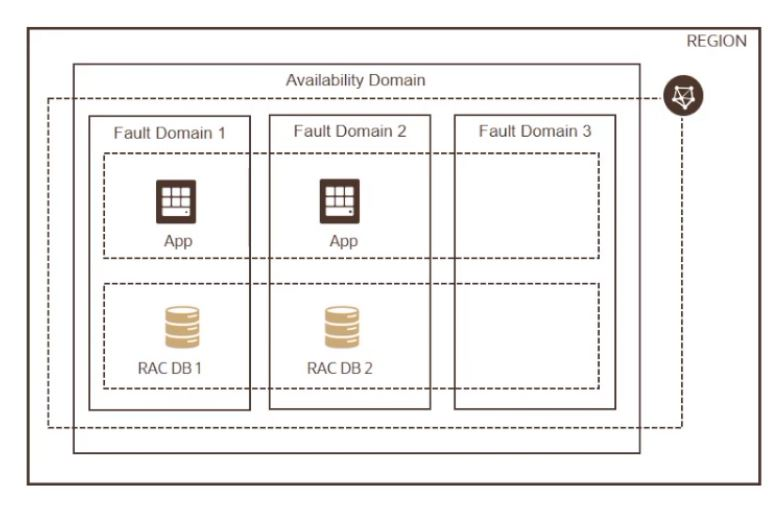
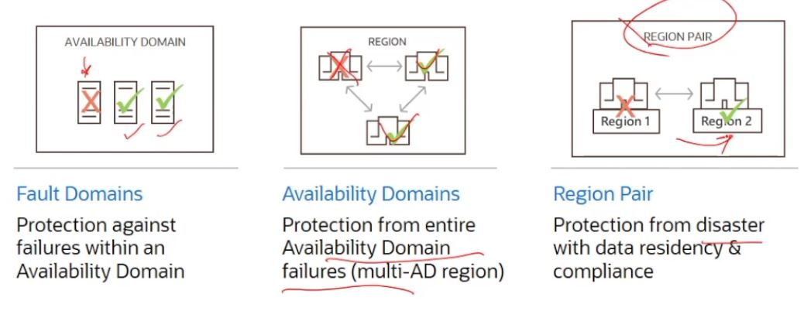
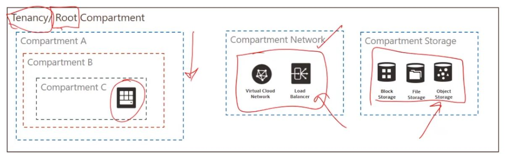

# OCI Architecture

## Global Footprint

21 Regions Live,
15 Planned

## OCI Physical Architure 

* Regions
Localized geographic area, comprised of one or more Availability Domains (ADs). Witghin regions 
there is/are AD

* Avaibility Domains
one or more fault tolerant isolated data centres located within a region ,
 connected to each other by low latency , high bandwidth network .
Within availability domains , you have this construct call fault domains

* Fault Domains
grouping of hardware and infrastructure within an availability domain to provide 
anti affinity (logical data centre)

## Choosing a region 

* Location 
choose a region closest to users for lowest latency and highest performance

* Data Residency & Compliance
many countries have strict data residency requirements 

* Service Availability 
new cloud services are made available based on regional demaind, regulatory compliance,
resource availability and other factors 

## Availability Domains

* AD are data center, isolated from each other, fault tolerant and very unlikely to fail simultaneously 

* AD :
    * Does not share physical infrastructre , i.e. power/cooling/internal availability domain network
    * failure that impacts one AD unlikely to impact others 

## Fault Domains
* Protection against failures within an AD 

* Each availability domains has 3 fault domains

* FD acts as logical data centre within an AD. Usage of multiple FDs reduces correlation of failures
within an AD

* Resources placed in different FDs will not share single points of hardware failure 

* In any regions, resources in at most ONE fault domain are being actively changed at any 
point in time, this means that availability problems caused by change procedures
are isolated at the fault domain level

* User can control placement of compute or database instances to fault domains at instance launch time ( Oracle handles the storage)

> Avoid single points of failure 

design architecture to deploy instances that perform the same tasks
* in different fault domains (in 1 AD regions)
* in different Avaibility Domains (with data guard )

RAC Database *Real Application Cluster *

## High Availability Design 

## Compartment 
compartment is a collection of related resources. it helps to isolate and control access to your 
resources 

can nest compartment up to six levels deep. 

root compartment can hold all the cloud resources. best practise is to create dedicated compartments
when you need to isolate resources 

1. Each resource belongs to a single compartment 
2. Resources can interact with other resources in different compartments 
3. Resouces and compartment can be added and deleted anytime
4. Resources can be moved from one compartment to another 
5. Resources from multiple regions can be in the same compartment 
6. compartments can be nested 
7. can give group of users access to compartments by writing policies 
8. Analyze cost and assign budget for resources in compartments 

